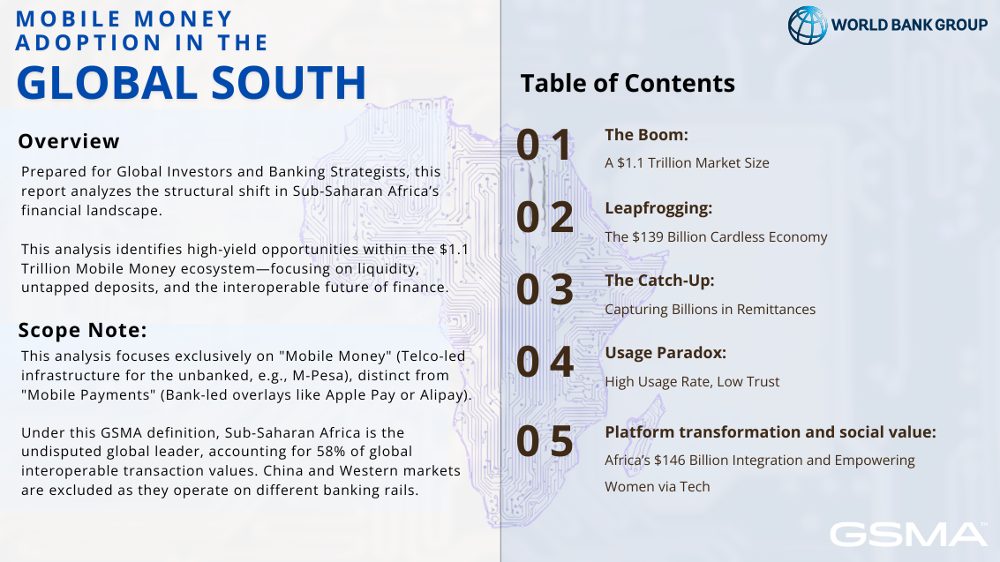
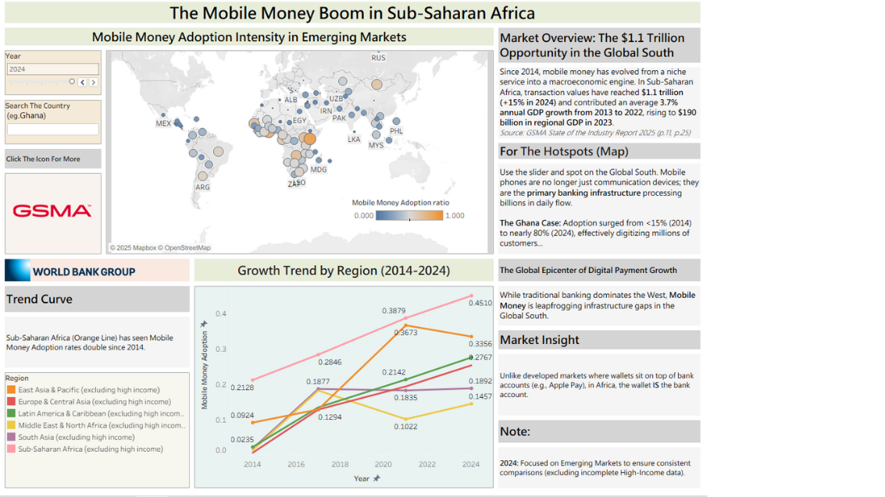
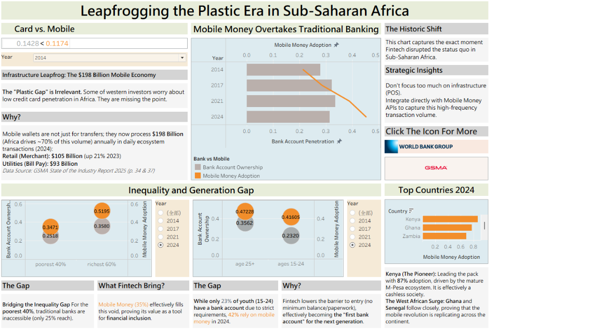
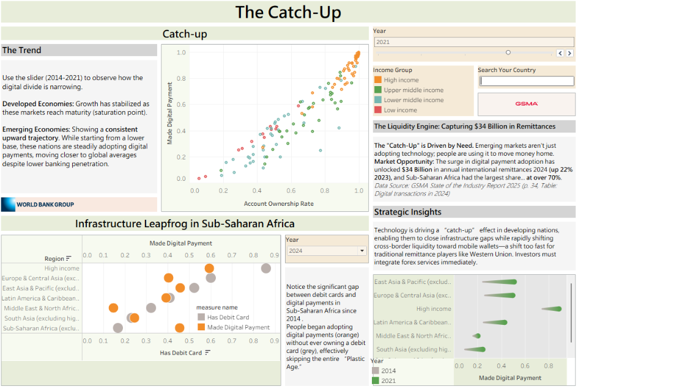
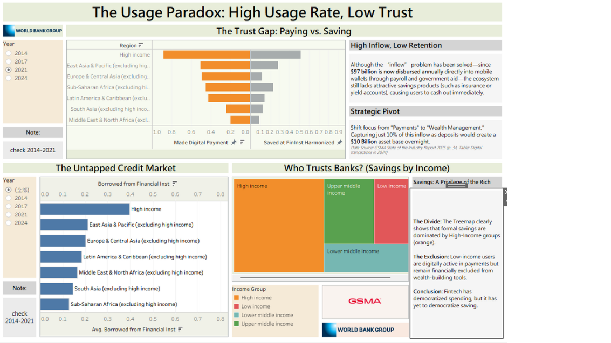
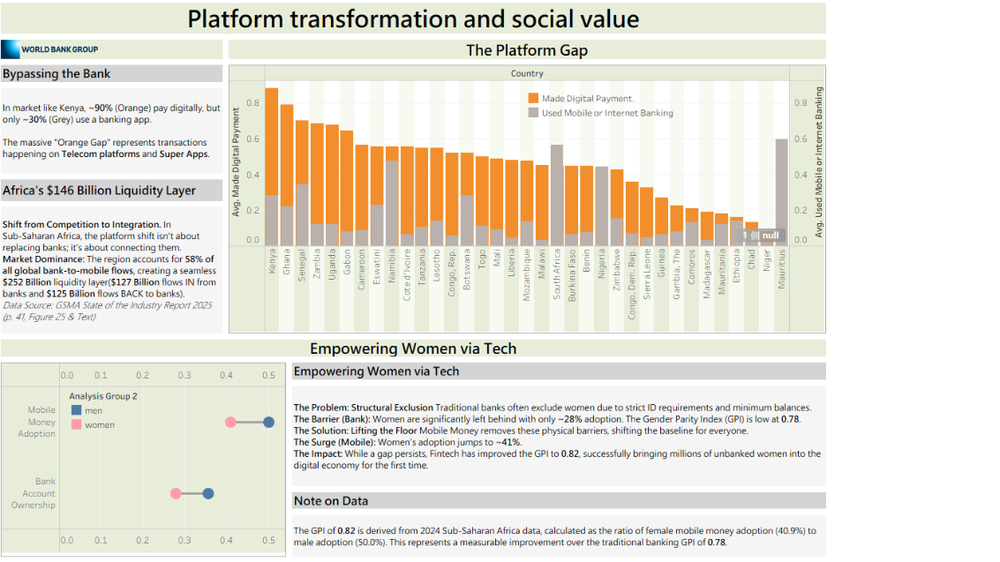
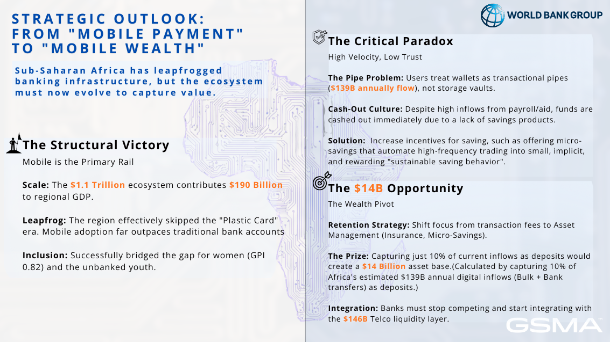

# Mobile Money Adoption in the Global South

**Business Analytics and Tableau portfolio project**

[繁體中文版](README.zh-TW.md)

This project analyses how mobile money is changing access to payments, banking, savings and liquidity across emerging markets, with a focus on Sub-Saharan Africa. It combines World Bank Global Findex indicators with GSMA mobile-money market context and presents the analysis as an interactive Tableau Story.

## View the interactive Tableau Story

[Open the project on Tableau Public](https://public.tableau.com/views/BANALAssignment2/STORY?:language=en-GB&:sid=&:redirect=auth&:display_count=n&:origin=viz_share_link)

## Business question

How is mobile money adoption changing the financial landscape in Sub-Saharan Africa, and where are the strongest opportunities for banks, investors and fintech strategists?

## What I built

- Cleaned and reshaped Global Findex indicators for Tableau analysis.
- Built interactive views for adoption intensity, regional growth, mobile-money leapfrogging, inequality, gender, age, remittances and savings behaviour.
- Compared mobile-money adoption with traditional bank-account ownership and digital-payment measures.
- Translated descriptive evidence into strategic questions around liquidity retention, savings products, interoperability and financial inclusion.
- Designed a five-part Tableau Story for an investor and banking-strategy audience.

## Key insights

- Sub-Saharan Africa shows a strong mobile-money adoption trajectory while traditional bank-account ownership remains lower in many markets.
- Kenya, Ghana and Zambia appear as leading mobile-money markets in the selected views.
- Mobile money can improve payment access and help narrow inclusion gaps, but high transaction usage does not automatically create retained deposits or long-term savings.
- The strategic opportunity is to move from a payment-only relationship towards savings, liquidity and wealth-management products.
- Differences by income, age and gender suggest that adoption is not uniform and that product design should be segmented.

These findings are descriptive and exploratory; they are not causal estimates.

## Story structure

| Story section | Analytical focus |
| --- | --- |
| The Boom | Market scale and mobile-money adoption intensity |
| Leapfrogging | Mobile money compared with traditional banking infrastructure |
| The Catch-Up | Relationship between account ownership and digital payment adoption |
| Usage Paradox | High payment usage, trust, savings and retention gaps |
| Platform transformation and social value | Liquidity, gender inclusion and strategic product opportunities |

## Data and tools

- **World Bank Global Findex 2025:** account ownership, mobile-money use, savings and borrowing indicators.
- **GSMA State of the Industry Report 2025:** market context and mobile-money ecosystem figures.
- **Tools:** Tableau, Python, pandas and Excel.

The original source files and Tableau workbooks are not included in this public repository. They contain large third-party datasets, course materials and/or embedded data extracts. The screenshots in [`screenshots/`](screenshots/) show the final analytical views, while the interactive story is available through Tableau Public. Source data should be obtained directly from the relevant providers and checked against their current licence terms.

## Dashboard previews

## Resume-ready summary

> Built a five-part Tableau Story using World Bank Global Findex and GSMA market data to analyse mobile-money adoption, banking access, liquidity and financial inclusion across emerging markets; translated dashboard evidence into strategic recommendations for banks, investors and fintech companies.
